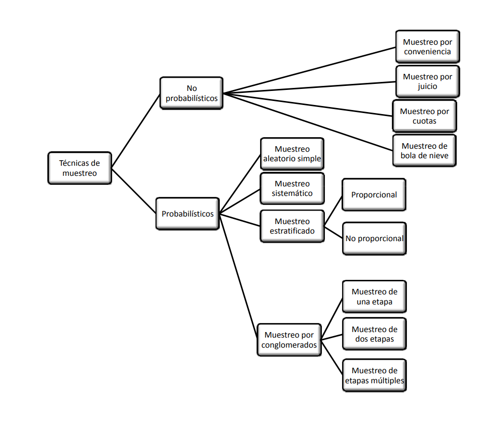
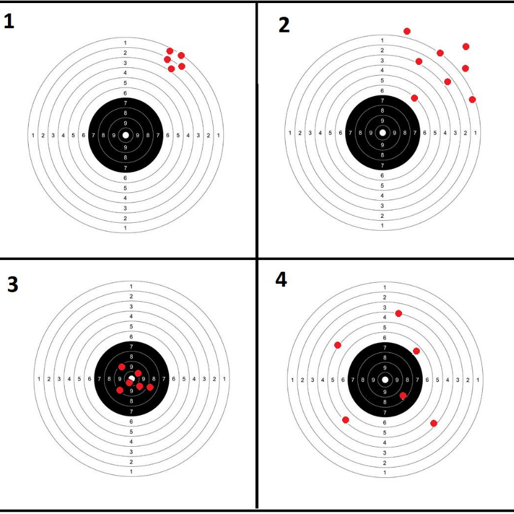

```{r setup, include=FALSE}
knitr::opts_chunk$set(echo = TRUE, comment = NA)
```

<br/><br/>

La inferencia estadística permite generalizar lo hallado en una muestra a toda la población. Para realizar este proceso contamos con dos opciones: Estimación y las Pruebas de hipótesis. El fundamento de estos procesos está relacioando con varios conceptos 


```{r, echo=FALSE, out.width="40%", fig.align='center'}

```


<br/><br/>

### **Población** 

En Estadística, se identifica el término población con el dominio de la variable aleatoria X, asociada a los objetos o individuos sobre los cuales se desarrolla un experimento y cuyo valor ocurre al azar. El estudio del conjunto de todas las mediciones de interés para un investigador se llama CENSO (Mendenhall (2008)). 

Como ejemplo podemos mencionar la población de habitantes de Colombia que se estudia a través del Censo de población que se debe realizar cada diez años. 

<br/><br/>

### **Muestra** 

Un subconjunto extraido de los elementos que conforman la población se denomina MUESTRA. Una definición técnica de muestra está dada por: repetición $n$ veces, en idénticas condiciones de la experiencia aleatoria, se puede obtener $n$ valores independientes de una variable aleatoria $X_{1}, X_{2},...,X_{n}$ a la que se le denomina muestra de la variable $X$.


<br/><br/>

### **Parámetro** 

Es una caracterización numérica de la distribución de probabilidad de una variable aleatoria. Como ejemplo de parámetros tenemos a $\mu$, $\sigma^{2}$ que determinan la función de probabilidad de una variable con distribución normal: 


$$f(x)=\frac{1}{\sqrt{2 \sigma^{2} \pi}} \exp{\Bigg(- \frac{1}{2 \sigma^{2}}\big(x-\mu\big)^{2}\Bigg)}$$
€n el caso que los valores correspondientes a estos parámetros son $\mu=100$ y $\sigma^{2}=25$   ($\sigma=5$) respectivamente, entonces la función de distribución de probabilidad quedará determinada por :

$$f(x)=\frac{1}{\sqrt{50 \pi}} \exp{\Bigg(- \frac{1}{50}\big(x-100\big)^{2}\Bigg)}$$

<br/><br/>

### **Estimador** 

Es una función de los valores obtenidos en una muestra aleatoria que da como resultado un valor que corresponde a una aproximación del parámetro objeto de estudio. Generalmente se representa como $\widehat{\theta}$. Como algunos ejemplos podemos citar:

$$\widehat{\mu}=\frac{1}{n}\sum_{i=1}^{n}x_{i}=\bar{x} $$

<br/><br/>

### **Estimación** 

<br/>

Es la evaluación o generación del estimador para una muestra determinada. 

Como ejemplo podemos utilizar uno de los estimadores que estudiaremos :  $\widehat{\mu}= \bar{x}$, para una muestra dada

<br/>

$$ 630, 650, 710, 750, 790, 820, 860 \text{ y } 910$$

<br/>

$$\widehat{\mu}=\frac{1}{n}\sum_{i=1}^{n} x_{i} =\frac{1}{8}(630+650+...+910)=765$$
El valor del estimador de $\mu$ para esta muestra es $$\widehat{\mu}=\bar{x}= 765$$.

<br/><br/>

### **Diseños Muestrales**

<br/>

Un diseño muestral es una estrategia de selección de unidades muestrales, mediante un proceso de aleatorización definido previamente (plan de muestreo). De acuerdo con esta definición, son tres los elementos esenciales de un diseño muestral:

<br/><br/>

#### **Unidad muestral**

Constituye la unidad básica a partir de la cual se obtiene la información, pudiendo por tanto, ser éstas personas,  o individuos de cualquier tipo si , por ejemplo nuestro interés es estimar la talla promedio; casas, número promedio de habitaciones, o el consumo de energía; comunidades, si los que nos interesa es el número promedio de especies por comunidad, áreas o cuadrículas si deseamos estimar densidades medias o biomasa total, etc.

<br/><br/>

#### **Proceso de aleatorización**

Este proceso debe garantizar que cada individuo de la población debe tener las misma posibilidad de ser seleccionado como representante de la población (aleatoriedad). Adicionalmente, exigimos que la elección de un individuo, no esté condicionada a la selección de otro (independencia). Estas dos condiciones, en apariencia sencillas, pueden provocar algunas  dificultades.

<br/><br/>

####  **Tamaño muestral**

Una vez que las unidades muestrales han sido definidas y se ha acordado un proceso de aleatorización, debemos preguntarnos, cuántas unidades debemos seleccionar para tener una buena representación en la  muestra.

Dado que cualquiera sea el proceso de selección de una muestra existe un costo asociado, el que en la mayoría de los casos constituye una exigencia ineludible, nuestro objetivo principal, será obtener el máximo de información con el menor tamaño de muestra que nos sea posible.

El tamaño de la muestra $n$ es función de tres elementos que son: la varianza, la confiabilidad y el error de muestreo. Los dos últimos a criterio del investigador.

$$n=\dfrac{z^{2}_{_{\alpha/2}} \times \sigma^{2}}{e^{2}}$$
Donde:

**Varianza** ($\sigma^{2}$):  Caracteriza la variable a estimar. Entre mayor sea su valor, mayor deberá ser el tamaño de la muestra. En ocasiones es necesario realizar una prueba piloto que nos permita tener un valor para calcular $n$. Otra alternativa puede ser el conocimiento empírico de expertos sobre el rango de la variable. Con este valor podemos estimar una aproximación de la desviación estándar como: $\sigma =$ rango/4. 

<br/>

**Confiabilidad** ($z_{\alpha/2}$ o percentil de la distribución normal estandar)b: Este concepto está relacionado con el grado de veracidad que tienen los resultados obtenidos. Si el estudio es repetido muchas veces, ¿ cuántas de estas coinciden con los resultados obtenidos?. Su valor está relacionado con el percentil de las distribución normal estándar, por ejemplo: una confiabilidad del 95% está relacionada con un valor de $z=1.96$.

<br/>

**Error de muestreo** ($e$) : corresponde a la diferencia entre el valor de la característica en la población (parámetro) y el valor obtenido con la información de la muestra (estimador).Equivale al error que estamos en capacidad de tolerar en las unidades de la variable.

<br/><br/>

### **Ejemplo**

El tamaño de muestra apropiado para estimar una media bajo las siguientes condiciones :

* Confianza del 95%
* Error de muestreo de 0.2
* Varianza de 1.6

La confianza del 95% implica que el restante 5% se distribuya a ambos lados en proporciones iguales. Cada cola de la distribución normal sea del 2.5%. Para este caso el correspondiente percentil será $z = 1.96$

$$n=\dfrac{1.96^{2} \times 1.6}{0.2^{2}}=153.6 \approxeq 154$$
En caso de poblaciones finitas, es necesario corregir el valor obtenido en caso que  $n/N > 0.05$

$$n=\dfrac{n_{0} \times N}{n_{0}+N-1}$$
En caso de tener N=200 , $154/20 >0.05$. El tamaño de muestra deberá ser corregido:

$$n= \dfrac{154 \times 200}{154 + 200 -1} =87.2 \approxeq 88 $$

<br/><br/>

### **Ejemplo**

En el caso de la estimación de una proporción el tamaño de muestra para su estimación está dado por :

$$n=\dfrac{z^{2}_{_{\alpha/2}} \times pq}{e^{2}}$$
Donde : 

* $z_{\alpha/2}$ : corresponde al percintil de la distribución normal asociado a $1-\alpha/2$.
* $pq$ : la varianza de la proporción que debe ser estimada mediante prueba piloto, pero que tambien se puede reemplazar por su valor máximo ($0.5 \times 0.5 = 0.25$) 
* $e$ : Error de muestreo, que corresponde a la diferencia entre el valor estimado y el parámetro a estimar $|\widehat{p}- p| < e$.

El tamaño de muestra apropiado estimar una proporción bajo las siguienes condiciones :

* Confianza del 95%
* Varianza máxima
* Error de muestreo de 0.02

$$n=\dfrac{1.96^{2} \times 0.25}{0.02^{2}} = 2401$$

<br/><br/>

## **Tipos de muestreo**


```{r, echo=FALSE, out.width="80%", fig.align='center'}

```


Los **métodos de muestreo probabilísticos** son aquellos que se basan en el principio de equiprobabilidad. Es decir, aquellos en los que todos los individuos tienen la misma
probabilidad de ser elegidos para formar parte de una muestra y, consiguientemente, todas las posibles muestras de tamaño n tienen la misma probabilidad de ser elegidas.

Sólo estos métodos de muestreo probabilísticos nos aseguran la representatividad de la muestra extraída y son, por tanto, los más recomendables. Dentro de los métodos de
muestreo probabilísticos encontramos los siguientes tipos:
De acuerdo con las consideraciones anteriores, algunas de las estrategias de muestreo más conocidas son:

* muestreo aleatorio simple 
* muestreo aleatorio sistemático 
* muestreo aleatorio estratificado 
* muestreo aleatorio por conglomerados

<br/><br/>

### **Muestreos no probabilísticos**

<br/>

En el caso de no contar con los supuestos que puedan garantizar la selección de la muestra de una manera aleatoria (no contar con un listado de la población o el no poder identificar con anticipación los elementos que conforman la población) y requerir de información para realizar analisis exploratorios, podemos utilizar otro tipo de muestreos llamados no probabílisticos. A continuación se describen algunos de ellos:

* muestre por cuotas
* muestreo por conveniencia
* muestreo por juicio
* muestreo bola de nieve


<br/><br/><br/>

## **Propiedades de los estimadores**

Dentro de las principales propiedeades de los estimadores están:

<br/>

### **Insesgadez**

Un estimador $\widehat{\theta}$ se considera insesgado si $E[\widehat{\theta}] = \theta$

<br/>

### **Eficiente**

Un estimador  $\widehat{\theta_{1}}$ se considera más eficiente que  $\widehat{\theta_{2}}$ cuando:

$$V[\widehat{\theta_{1}}] < V[\widehat{\theta_{2}}]$$

### **Consistente**

<br/>

Cuando un estimador siendo sesgado, se convierte en un estimador sesgado cuando se aumenta el tamaño de la muestra se dice que este estimador es consistente

<br/><br/>


```{r, echo=FALSE, out.width="50%", fig.align='center'}

```

<br/><br/><br/>

### **Ejemplo**

Para una variable con distribución uniforme $unif(a=0, b=20)$ se desea determinar las propiedades de los siguientes  estimadores del parámetro $b$


* $\widehat{\theta_{1}} = 2 \bar{x}$ 

* $\widehat{\theta_{2}} = \max\{x\}$

* $\widehat{\theta_{3}} = \dfrac{(n+1)}{n} \max\{x\}$

<br/><br/>


<!-- ```{r, warning=FALSE, message=FALSE} -->
<!-- # uniforme -->
<!-- library(ggplot2) -->
<!-- x= c(0,20)  -->
<!-- fx=c(1/20, 1/20)  -->
<!-- dat=data.frame(x,fx) -->
<!-- ggplot(data=dat,aes(x=x, y=fx))+  -->
<!--   scale_y_continuous(limits=c(0,.05))+ -->
<!--   geom_line(size = 1,colour = 'red')  -->
<!-- ``` -->


Para ello se realiza una simulación, para posteriormente evaluar los estimadores propuestos y determinar sus propiedades.


<br/><br/>

```{r, warning=FALSE, message=FALSE}
library(ggplot2)
n=10
m=1000*n
Y=matrix(runif(m, min=0, max=20), ncol=n) # matriz de datos m x n
Mx=apply(Y,1,mean)
Max=apply(Y,1,max)
T1=2*Mx
T2=Max
T3=((n+1)/n)*T2
T123=data.frame(T1,T2,T3)

boxplot(T123, las=1, main="Comparación estimadores con n=10")
abline(h=20,  col="red")
apply(T123,2,mean)
```

<br/><br/>

Para un tamaño de muestra $n=10$ se observa que los mejores resultados se obtienen con $T3$. Este estimador se puede clasificar como INSESGADO y EFICIENTE, pues ademas que su promedio está muy cerca de $20$, tiene la menor varianza


```{r}
n=100
m=1000*n
Y=matrix(runif(m, min=0, max=20), ncol=n) # matriz de datos m x n
Mx=apply(Y,1,mean)
Max=apply(Y,1,max)
T1=2*Mx
T2=Max
T3=((n+1)/n)*T2
T123=data.frame(T1,T2,T3)

boxplot(T123, las=1, main="Comparación estimadores con n=100")
abline(h=20,  col="red")
apply(T123,2,mean)


```


Los resutados indican que el mejor estimador de $b$ corresponde a $T3$. Sin embargo el estimador $T2$ que era insesgado al aumentar el tamaño de la muestra pasando de $n=10$ a $n=100$ se observa que su promedio se acerca mas a $20$ que corresponde al valor del parametro 

<br/><br/>


