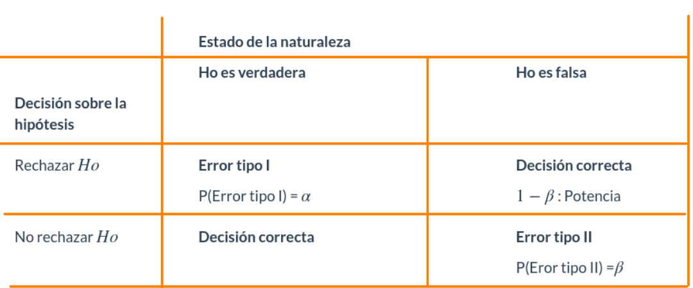

```{r setup, include=FALSE}
knitr::opts_chunk$set(echo = TRUE)
```

<br/><br/>


```{r, echo=FALSE, out.width="70%", fig.align = "center"}

```

<br/><br/>

El origen de los estudios, relacionados con las pruebas de hipótesis estadísticas, se sitúa alrededor de 1738, cuando en un ensayo escrito por Daniel Bernoulli(1) aparece el cálculo una estadística de prueba para ensayar su hipótesis en el campo de la astronomía. Entre 1915 y 1933 se desarrolla esta formulación gracias a los estudios realizados por tres grandes autores: Ronald Fisher(2), Jerzy Neyman(3) y Egon Pearson(4). Generandose así dos enfoques diferentes.

<br/><br/>

```{r, echo=FALSE, out.width="30%", fig.align = "center"}

```
<br/><br/>

Una hipótesis estadística es una afirmación o conjetura acerca de los parámetros de la distribución de probabilidades de una población. Si la hipótesis estadística especifica completamente la distribución, entonces ella se llama **Hipótesis Simple**, de otra manera se llama Hipótesis Compuesta. 

Desde el punto de vista clásico, todas las pruebas de hipótesis trabajan en base a ciertos principios que consideran:

* Hipótesis nula (**Ho**)
* Hipótesis alterna (**Ha**)
* Estadístico de Prueba (**EdeP**)
* Región de Rechazo (**RdeR**)
* Regla de Decisión(**RD**)


<br/><br/>


### **Hipótesis Nula (Ho)** 

Es la hipótesis a probar, ésta NO se rechaza si de la muestra no se obtiene suficiente evidencia para rechazarla.

<br/><br/>

### **Hipótesis Alterna (Ha)** 

La hipótesis `Ho` se contrasta con la hipótesis Ha, y ésta última corresponde a valores alternativos del parámetro planteados en la hipótesis nula. La hipótesis $Ha$ se considera cierta si existe suficiente evidencia para rechazar la hipótesis nula.

<br/><br/>

### **Estadístico de Prueba**  

Es una función de la muestra que contiene información sobre el parámetro de interés, la que nos permite decidir sobre el rechazo de la hipótesis nula, `Ho` . Es tambien una variable aleatoria que sigue una función de distribución conocida como por ejemplo:

Para una muestra determinada se obtiene un valor del estadístico de prueba, a partir del cálculo y se determina el rechazo o no, de la hipótesis nula.

<br/><br/>

### **Región de Rechazo (RdeR)**  

También llamada región crítica (`RC`), define los valores del estadístico de prueba para los cuales la información muestral contradice la hipótesis nula. Estos valores nos permitirán adoptar una regla de decisión consistente. Una prueba de una hipótesis estadística es un procedimiento que permite, mediante el contraste entre la información muestral y lo propuesto en una hipótesis, decidir sobre
su rechazo. 

Una prueba de una hipótesis estadística es un procedimiento que permite, mediante el contraste entre la información muestral y lo propuesto en una hipótesis, decidir sobre
su rechazo. 

<br/><br/>

### **Regla de Decisión (RD)**  

De esta manera, como una regla de decisión, si para una muestra particular el estadístico de prueba (valor calculado) cae dentro de la región crítica, rechazaremos la hipótesis nula `Ha` en favor de la hipótesis alternativa `Ha`. En cambio, si el valor calculado no cae dentro de la RC, no podremos rechazar la hipótesis nula y por tanto decimos que la información contenida en la muestra no ofrece suficiente evidencia estadística que nos permita rechazar` `Ho`, ASUMIMOS que la hipótesis nula es cierta. 

Cuando se decide ya sea en favor o en contra de una determinada prueba de hipótesis, es posible estar en una de las cuatro situaciones descritas en la siguiente tabla:


```{r, echo=FALSE, out.width="100%", fig.align = "center"}

```


Existen dos situaciones en las que se comenten errores después de tomar una decisión:

<br/><br/>

### **Error tipo I**: 

Cuando se rechazamos una hipótesis nula que en realidad es verdadera. Tomando como simil la situación donde un médico desea determinar si un paciente está sano o enfermo (`Ho`: SANO vs `Ha`: ENFERMO), es posible que concluya que el paciente está enfermo (rechace `Ho`) cuando en verdad esta persona esta sana. En términos de probabilidad este error se debe de representar como:

$$P(\text{Rechazar } Ho | Ho \text{ es verdadera})= \alpha$$

<br/><br/>

### **Error Tipo II**: 

Cuando no se rechaza una hipótesis nula que en realidad es falsa. Utilizando el ejemplo del médico, diríamos que cuando el medico indica que el paciente esta sano, cuando esta realmente enfermo, incurre en un error frecuente cuando algunos pacientes son asintomáticos y aunque tienen la enfermedad, sus exámenes médicos salen negativos. En este caso la probabilidad se representa como:

$$P(\text{No rechazar} Ho | Ho \text{ es falsa}) $$
<br/><br/>

### **Nivel de significancia ($\alpha$)**  

No es posible minimizar simultáneamente, las probabilidades de los errores tipo I y II, ya que en la medida que uno disminuye el otro aumenta, como se muestra en la figura siguiente, en la que claramente se ve que la reducción del área $\alpha$ (probabilidad de error tipo I), implica el aumento del área $\beta$ (probabilidad de error tipo II).


<br/><br/>


### **Valor-p** 

El valor-p corresponde al área delimitada por el `EdeP` en el sentido que indica la `RdeR` de la prueba a contrastar. Es decir que corresponde a la probilidad  máxima de cometer `error tipo I`.

[Gil, Jacky F.; Castañeda, Javier A (2005)](https://www.redalyc.org/pdf/806/80634308.pdf) lo definen como :

*El resultado de la prueba de hipótesis se basa principalmente en el cálculo, en términos de probabilidad, de la fuerza de los hallazgos a favor de la hipótesis nula. Esta probabilidad recibe el nombre de valor-p, y se define como la probabilidad de cometer un falso positivo por efecto del azar, cuando la hipótesis nula es verdadera.*

<br/><br/>

## **Reglas de decisión**

<br/><br/>

### **Regla 1** : 

Si el $EdeP$ cae en la $RdeR$, entonce se rechaza la $Ho$ y se **ACEPTA** $Ha$ como verdadera. Si por el contrario el $EdeP$ NO cae en la $RdeR$, entonces NO SE RECHAZA $Ho$, no existe suficiente evidencia para rechazarla, se **ASUME** que $Ho$ es verdad.

<br/><br/>

### **Regla 2** 

Si $\alpha >$ **valor-p** entonces se rechaza $H_{0}$, se **ACEPTA** $Ha$ como verdadera. Si por el contrario $\alpha <$ $valor-p$, no rechazamos $Ho$, se **ASUME** 	que $Ho$ es verdad. 


<br/><br/>

### **Regla 3**

El $valor-p$ se interpreta como el error que puedo cometer al rechazar $Ho$, siendo esta verdadera (cometer $Error$ $tipo$ $I$). Si este valor es considerado como pequeño, se rechaza $Ho$, se **ACEPTA** $Ha$. Si por el contrario se considera este valor grande, entonce no rechazo $Ho$, se **ASUME**  que $Ho$ es verdad.


